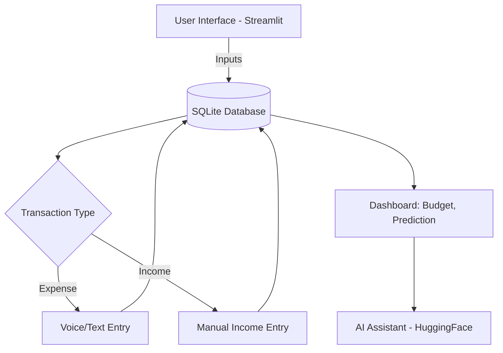

<h1 align="center">💸 Smart Expense Tracker</h1>

<p align="center">
  
  
  
</p>

<p align="center">
  <b>Not just another expense tracker.</b><br>
  A smart, interactive, AI-powered web app that helps you manage finances using <i>voice, predictions, budget visualization, and financial intelligence.</i>
</p>

---

## 🧠 Why Smart Expense Tracker?

Most expense trackers are static and manual. Ours is different.
It understands your **voice**, predicts your **future spending**, and gives **AI-backed financial advice** — all in a smooth, intuitive UI.

### 🔍 Real-World Problem Solved

| Problem                  | Smart Solution                                          |
| ------------------------ | ------------------------------------------------------- |
| Manual entry fatigue     | 🎤 Voice input automates adding transactions            |
| No foresight on spending | 🔮 ML predicts your next month’s expense                |
| Poor budget habits       | 📊 Budget goal + progress bar for discipline            |
| Lack of insights         | 🤖 AI assistant answers your personal finance questions |

---

## 🛠️ Tech Stack

| Technology                  | Purpose                           |
| --------------------------- | --------------------------------- |
| `Python`                    | Core language                     |
| `Streamlit`                 | UI framework                      |
| `SQLite`                    | Lightweight database              |
| `Vosk`                      | Offline voice recognition         |
| `SpeechRecognition`         | Captures and processes user voice |
| `scikit-learn`              | Linear Regression for predictions |
| `Hugging Face Transformers` | Offline AI advisor                |
| `dotenv`                    | Secure environment management     |

---

## 🎯 Features Overview

| 🔧 Feature                  | 💬 Description                                      |
| --------------------------- | --------------------------------------------------- |
| 🎤 **Voice Input**          | Say "500 rupees for food" – and it logs it          |
| 📥 **Manual Entry**         | Add income or expenses through simple forms         |
| 🤮 **AI Advisor**           | Ask financial questions and get smart advice        |
| 📊 **Budget Tracker**       | Set a monthly goal and track your progress visually |
| 🔮 **ML Prediction**        | See what you might spend next month                 |
| 🗑️ **Transaction Manager** | View, sort, and delete transactions                 |

---

## 🧹 Architecture Flow



---

## 📂 File Structure

```
📆smart-expense-tracker
🔚📄 test.py                  # Main Streamlit app
🔚📄 vosk-model/              # Offline voice recognition model
🔚📄 expenses.db              # SQLite DB (auto-generated)
🔚📄 .env                     # For API key (if OpenAI used)
```

---

## 🚀 Getting Started

### 1. Clone the Repository

```bash
git clone https://github.com/yourusername/smart-expense-tracker.git
cd smart-expense-tracker
```

### 2. Install Dependencies

```bash
pip install -r requirements.txt
```

### 3. Download Vosk Model

Download and unzip [vosk-model-small-en-in](https://alphacephei.com/vosk/models) and place the folder as:

```
vosk-model/
```

### 4. Run the App

```bash
streamlit run test.py
```

---

## 💡 Sample Voice Commands

```plaintext
"500 rupees for food"
"1200 for rent"
"3000 rupees for entertainment"
```

---

## 🤖 Sample AI Advisor Questions

| Question                                        | Use                |
| ----------------------------------------------- | ------------------ |
| "How can I cut down on food expenses?"          | Expense analysis   |
| "Am I overspending this month?"                 | Budgeting insights |
| "Should I save more or invest?"                 | Financial planning |
| "What categories are taking most of my income?" | Category analysis  |

---

## 🔐 Environment Variables (Optional)

To use OpenAI API instead of HuggingFace:

```ini
# .env
OPENAI_KEY=your_openai_api_key_here
```

---

## 🌍 Roadmap

* [x] Voice expense entry via Vosk
* [x] Manual expense/income logging
* [x] Budget and prediction system
* [x] Offline Hugging Face financial advisor
* [ ] Data export as CSV
* [ ] Dark mode UI
* [ ] Graphical category analytics

---

## 👨‍💼 Author

Made with ❤️ by [Arish Shahid](https://www.linkedin.com/in/arishshahid)

If you liked this project, don’t forget to ⭐ the repo!

---


